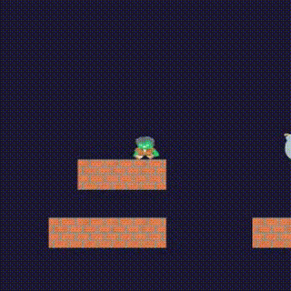

# Enhancing Interpretability in Deep Reinforcement Learning through Semantic Clustering

**Authors:** Liang Zhang, Justin Lieffers, Adarsh Pyarelal  
**Conference:** NeurIPS 2025 Main Track

This repository contains the official implementation of our research on enhancing interpretability in deep reinforcement learning through semantic clustering techniques. Our work extends the [OpenAI train-procgen](https://github.com/openai/train-procgen) framework to incorporate semantic clustering methods for improved understanding and visualization of learned policies in procedural environments.

## 📋 Abstract

This work presents a novel approach to enhancing interpretability in deep reinforcement learning by leveraging semantic clustering techniques. We demonstrate how semantic clustering can provide insights into learned policies, enabling better understanding of agent behavior and decision-making processes in complex procedural environments.

## 🚀 Quick Start

### Installation

Prerequisite: Python 3.8.

1. **Clone the repository:**
   ```bash
   git clone https://github.com/ualiangzhang/semantic_rl.git
   cd semantic_rl
   ```

2. **Install dependencies (Python 3.8):**
   ```bash
   pip install -r requirements.txt
   ```

3. **Install Procgen environments:**
   Follow the installation steps in the [Procgen repository](https://github.com/openai/procgen).

### Basic Usage

**Train a semantic clustering model:**
```bash
python -m train_procgen.train_sppo --env_name <ENV_NAME> --num_levels 0 --distribution_mode easy --timesteps_per_proc 25000000 --rand_seed <RAND_SEED>
```

**Train a baseline model:**
```bash
python -m train_procgen.train_ppo --env_name <ENV_NAME> --num_levels 0 --distribution_mode easy --timesteps_per_proc 25000000 --rand_seed <RAND_SEED>
```

## 📊 Visualization and Analysis

### Performance Analysis

**Generate generalization figures for a single game:**
```bash
cd train_procgen
python single_graph.py --env_name <ENV_NAME>
# Example:
python single_graph.py --env_name coinrun
```

### Semantic Clustering Visualization

**Generate embedding space visualizations:**
```bash
python -m train_procgen.enjoy_sppo --env_name <ENV_NAME> --mode 1
```

**Generate skill demonstration videos:**
```bash
python -m train_procgen.enjoy_sppo --env_name <ENV_NAME> --mode 0
```

**Interactive cluster exploration:**
```bash
python -m train_procgen.hover_clusters --env_name <ENV_NAME>
# Example:
python -m train_procgen.hover_clusters --env_name fruitbot
```

## 🎮 Supported Environments

Our implementation supports four Procgen environments:
- **CoinRun**
- **FruitBot**
- **Jumper**
- **Ninja**

## 🎬 Semantic Clustering Demonstration

### Ninja Environment - 8 Semantic Clusters

The following videos demonstrate the 8 distinct semantic clusters learned by our model in the Ninja environment. Each cluster represents a different behavioral pattern and skill set:

#### 📹 Semantic Cluster Demonstrations

<table>
<tr>
<td align="center">
<strong>Cluster 0</strong><br/>

</td>
<td align="center">
<strong>Cluster 1</strong><br/>

</td>
<td align="center">
<strong>Cluster 2</strong><br/>

</td>
<td align="center">
<strong>Cluster 3</strong><br/>

</td>
</tr>
<tr>
<td align="center">
<strong>Cluster 4</strong><br/>

</td>
<td align="center">
<strong>Cluster 5</strong><br/>

</td>
<td align="center">
<strong>Cluster 6</strong><br/>

</td>
<td align="center">
<strong>Cluster 7</strong><br/>

</td>
</tr>
</table>

#### 🧭 Behavior Descriptions (Ninja)

| Cluster | Behavior |
|---------|----------|
| 0 | The agent starts by walking through the first platform and then performs a high jump to reach a higher ledge. |
| 1 | The agent makes small jumps in the middle of the scene. |
| 2 | Two interpretations are present: (1) the agent starts from the leftmost end of the scene and walks to the starting position of Cluster 0; (2) when there are no higher ledges to jump to, the agent begins from the scene, walks over the first platform, and prepares to jump to the subsequent ledge. |
| 3 | The agent walks on the ledge and prepares to jump to a higher ledge. |
| 4 | After performing a high jump, the agent loses sight of the ledge below. |
| 5 | The agent walks on the ledge and prepares to jump onto a ledge at the same height or lower. |
| 6 | The agent executes a high jump while keeping the ledge below in sight. |
| 7 | The agent moves towards the right edge of the scene and touches the mushroom. |

#### 📊 Alternative: Generate Your Own Videos

You can also generate these videos yourself using our code:

```bash
# Generate Ninja skill cluster videos
python -m train_procgen.enjoy_sppo --env_name ninja --mode 0 --num_embeddings 8
```

**Note:** These videos showcase the distinct behavioral patterns learned by our semantic clustering approach. Each cluster demonstrates different combat strategies, movement patterns, and decision-making processes in the Ninja environment.

## 📁 Output Structure

```
baseline/                # Required RL training package
train_procgen/
├── checkpoints/         # Trained model checkpoints
├── figures/             # Generated visualizations and videos
videos/                  # video clips corresponding to the clusters in the paper
```

## 📈 Reproducing Results

To reproduce the results from our paper:

1. **(Optional) Use existing checkpoints**: If you already have trained checkpoints under `train_procgen/checkpoints/`, you can skip training and directly run the visualization scripts. Otherwise, **train models** using the commands above.
2. **Generate visualizations** using the provided scripts
3. **Analyze results** using the interactive tools

**Note:** Video generation may take 30-60 minutes depending on machine performance, as it ensures comprehensive exploration of all clusters.

<!-- ## 🤝 Citation

If you use this code in your research, please cite our paper: -->

<!-- ```bibtex
@article{zhang2025enhancing,
  title={Enhancing Interpretability in Deep Reinforcement Learning through Semantic Clustering},
  author={Zhang, Liang and Lieffers, Justin and Pyarelal, Adarsh},
  journal={Advances in Neural Information Processing Systems},
  year={2025}
}
``` -->

## 📄 License

This project is licensed under the MIT License - see the [LICENSE](LICENSE) file for details.

## 🙏 Acknowledgments

This work builds upon the [OpenAI train-procgen](https://github.com/openai/train-procgen) framework. We thank the original authors for their excellent work on procedural generation for reinforcement learning benchmarking.